# Repair & Return Operations Dashboard | Power BI


> Enterprise-level Power BI solution for monitoring Repair & Return operations using advanced DAX, Power Query, data modeling, and interactive operational dashboards.

---

## Dashboard Preview

<!-- Upload the final banner image to Images/00-Project-Banner.png -->
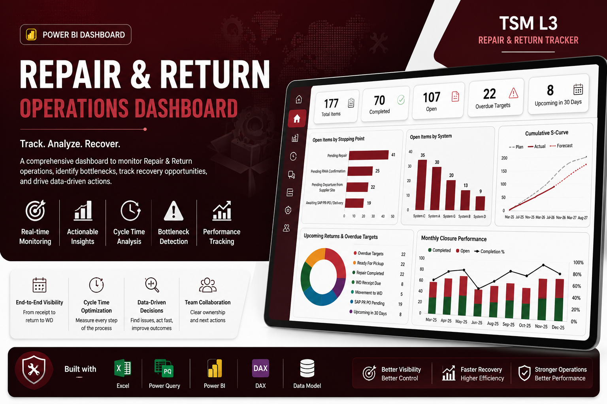

<!-- Upload the main walkthrough GIF to GIFs/01-Dashboard-Walkthrough.gif -->


---

## Table of Contents

- [Project Overview](#project-overview)
- [Business Problem](#business-problem)
- [Solution](#solution)
- [Key Results](#key-results)
- [Dashboard Pages](#dashboard-pages)
- [Architecture](#architecture)
- [Data Model](#data-model)
- [Power Query Workflow](#power-query-workflow)
- [DAX Highlights](#dax-highlights)
- [Key Performance Indicators](#key-performance-indicators)
- [Business Impact](#business-impact)
- [Technology Stack](#technology-stack)
- [Repository Structure](#repository-structure)
- [How to Use](#how-to-use)
- [Data Privacy](#data-privacy)
- [Future Improvements](#future-improvements)
- [Author](#author)

---

## Project Overview

The **Repair & Return Operations Dashboard** is a complete Business Intelligence solution developed in Microsoft Power BI to monitor the end-to-end repair lifecycle of critical spare parts.

The solution transforms a complex operational tracker into an interactive reporting environment that supports operations, maintenance, logistics, warehouse, supply chain, and management teams.

The dashboard provides visibility into:

- Repair progress and completion status
- Current operational stopping points
- Supplier and manufacturer performance
- Repair, RMA, AWB, warehouse, and total cycle time
- Aging and overdue items
- Upcoming warehouse returns
- Forecast versus actual performance
- Repeated failures and critical stock risk
- Recovery opportunities and action ownership

---

## Business Problem

Repair & Return operations typically involve multiple suppliers, repair centers, warehouses, logistics stages, internal approvals, and operational teams.

Without centralized reporting, management may face:

- Limited visibility into repair progress
- Difficult supplier follow-up
- Long and inconsistent repair cycles
- Delayed warehouse returns
- Manual and time-consuming reporting
- Poor bottleneck identification
- Limited forecasting capability
- No centralized operational KPI framework
- Difficulty prioritizing critical or overdue cases

---

## Solution

This Power BI solution consolidates operational data into a structured analytical model and provides a multi-page interactive dashboard.

The solution enables users to:

- Monitor open, completed, and incoming items
- Identify where items are currently blocked
- Analyze supplier concentration and performance
- Track overdue targets and upcoming returns
- Compare forecasted and actual warehouse receipts
- Measure cycle time by process stage
- Detect recurring faulty parts
- Assess stock and criticality risk
- Prioritize operational recovery actions

---

## Key Results

The published anonymized version demonstrates:

| Metric | Value |
|---|---:|
| Total tracked items | 177 |
| Completed items | 70 |
| Open items | 107 |
| Completion rate | 39.55% |
| Suppliers monitored | 11 |
| Countries represented | 8 |
| Oldest open case | 407 days |
| Open cases older than 365 days | 5 |

> The figures above are based on the anonymized portfolio version and are included to demonstrate dashboard behavior and analytical logic.

---

## Dashboard Pages

### 1. Executive Overview

Provides a management-level summary of total items, completion status, open workload, recent receipts, and upcoming returns.

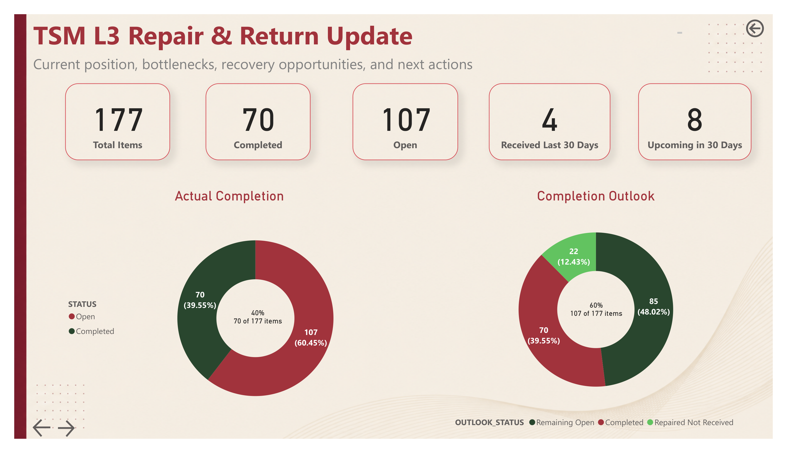

### 2. Open Items by Stopping Point

Highlights where open repair cases are currently blocked across the operational process.

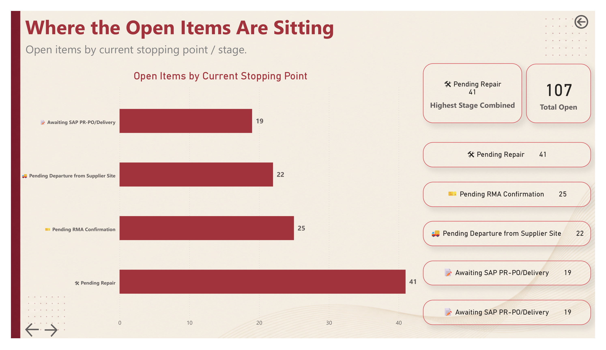

### 3. Open Items by System

Shows workload concentration across operational systems.

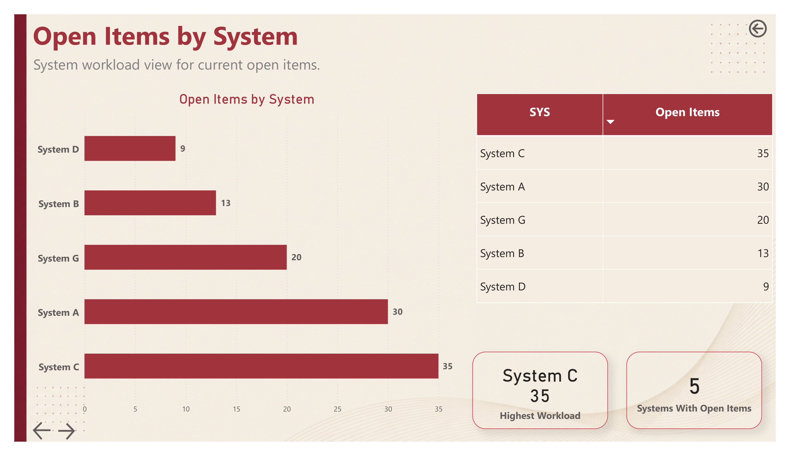

### 4. Supplier Performance

Analyzes open workload by supplier and highlights supplier concentration risk.

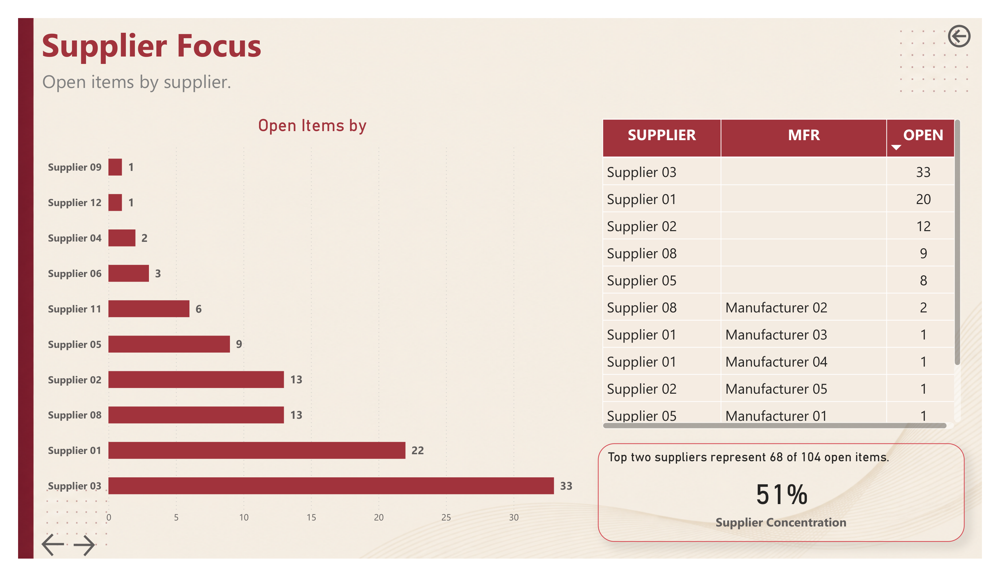

### 5. Stopping Point Summary

Provides a complete distribution of cases across all repair and return stages.

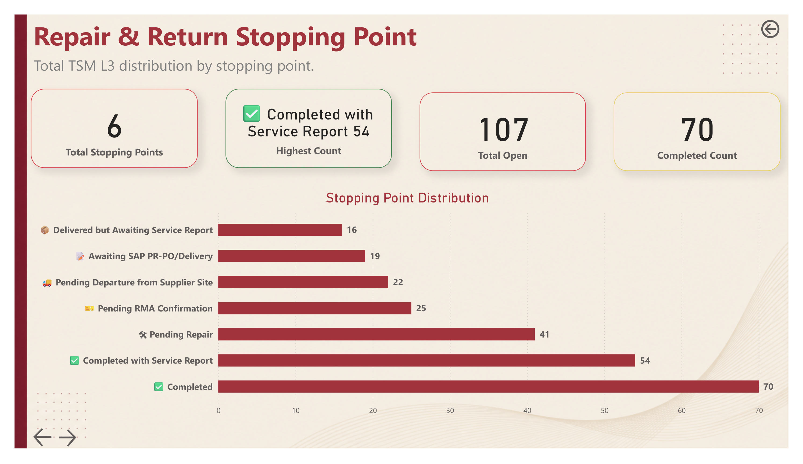

### 6. Aging and Critical Attention

Identifies the oldest open items and cases requiring immediate follow-up.

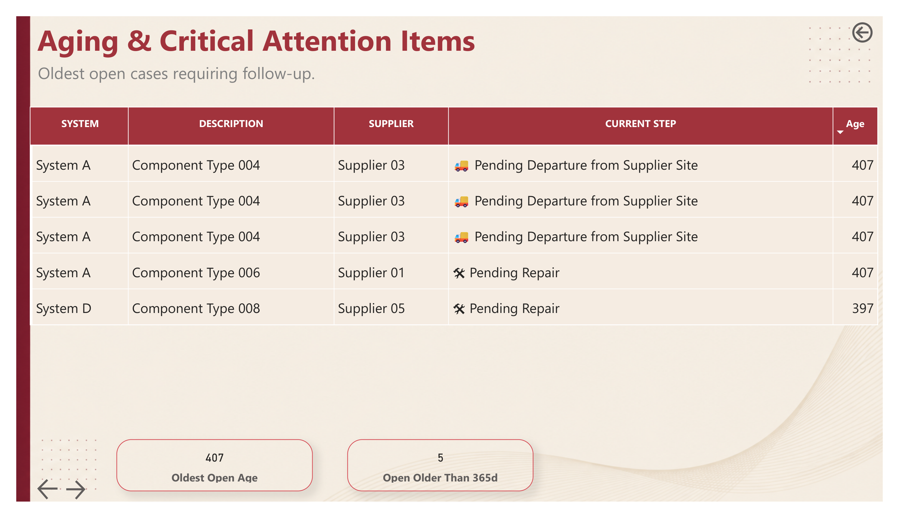

### 7. Upcoming Returns and Overdue Targets

Tracks upcoming returns, ready-for-pickup items, overdue targets, and warehouse movement opportunities.

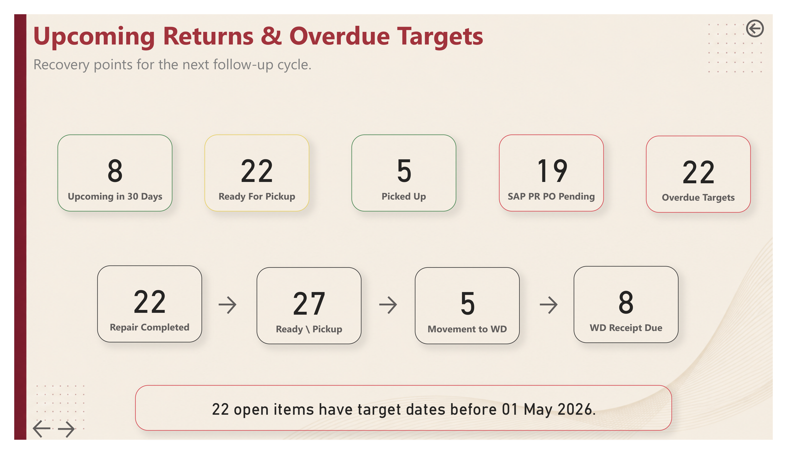

### 8. Supplier Footprint

Displays the geographic distribution of suppliers and received faulty parts.

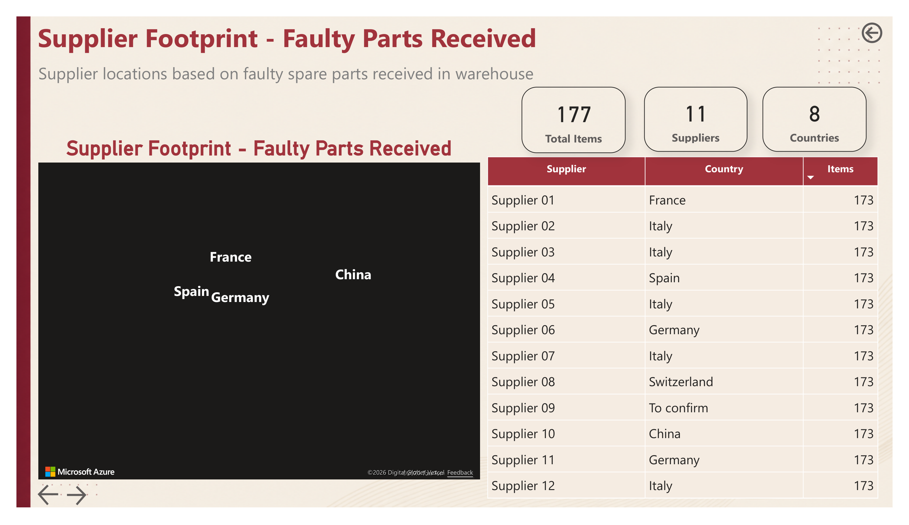

### 9. Cumulative S-Curve

Compares cumulative forecast, faulty items received, and actual warehouse returns.

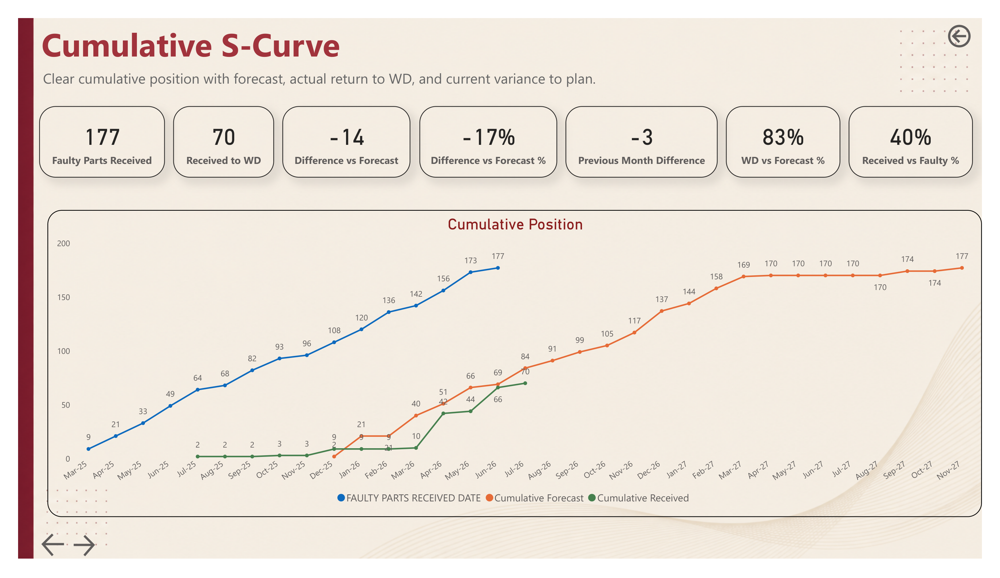

### 10. Monthly Closure Performance

Compares monthly faulty receipts, supplier arrivals, and completed returns.

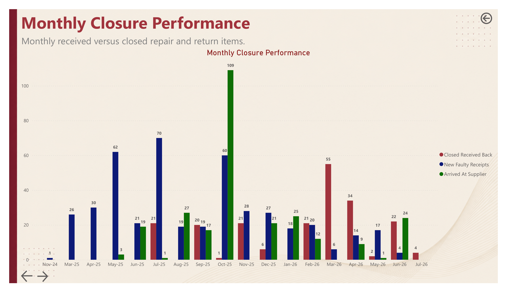

### 11. Cycle Time by Step

Measures the average duration of each operational stage and the total end-to-end cycle.

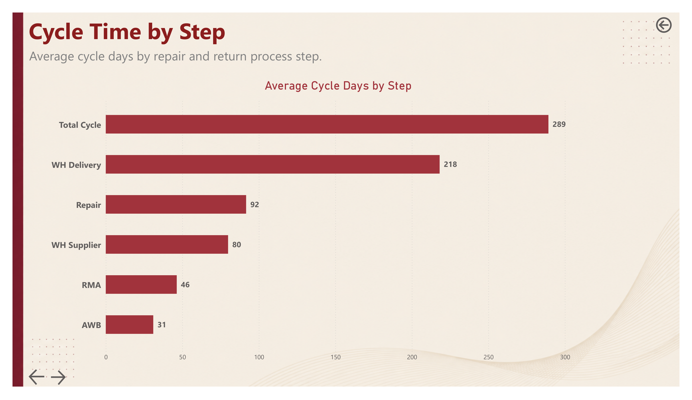

### 12. Monthly Cycle Performance

Tracks changes in cycle performance by warehouse receipt month.

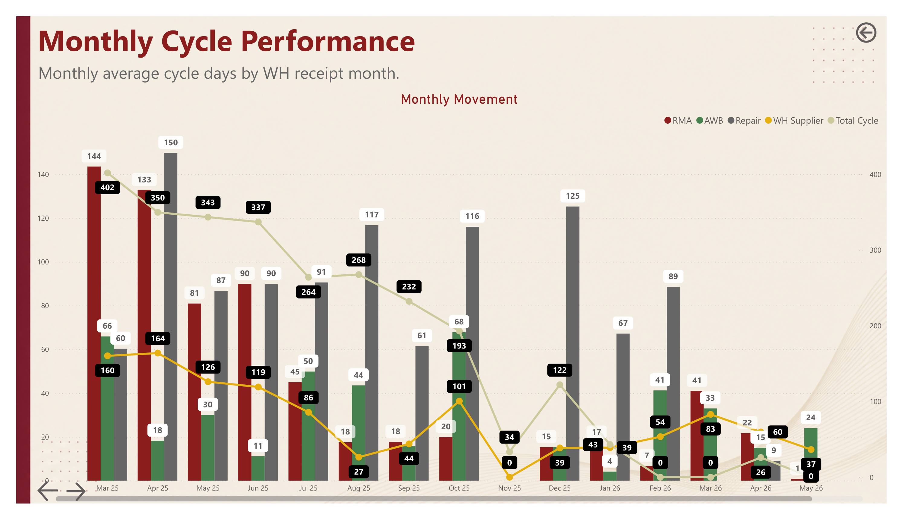

### 13. Repeat Failure Watchlist

Identifies recurring faulty descriptions and repeated part numbers for technical review.

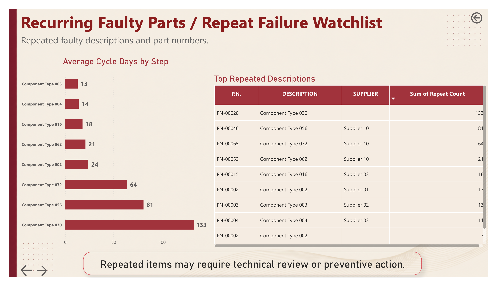

### 14. Critical Spare Parts and Stock Risk

Compares faulty quantities against available stock and classifies critical shortages.

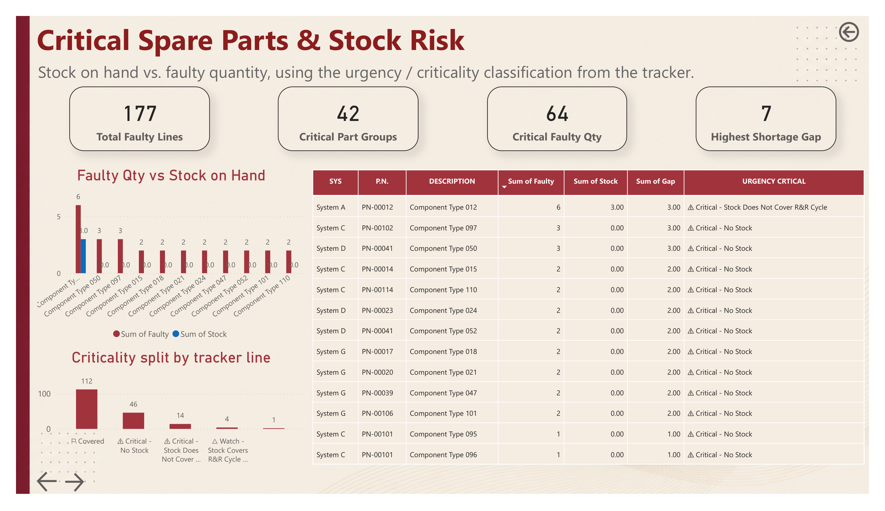

### 15. Proposed Team Action Plan

Translates analytical findings into clear operational actions and ownership priorities.

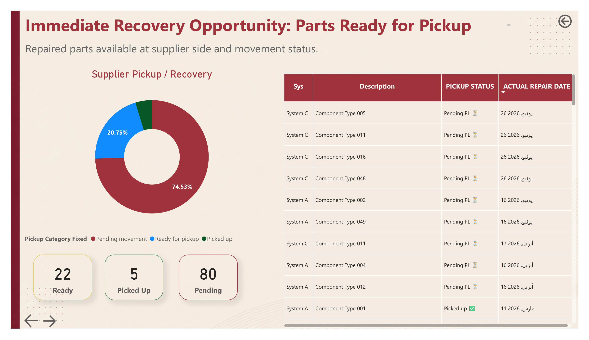

---

## Architecture

The solution follows a standard analytical workflow:

```text
Excel Operational Tracker
        │
        ▼
Power Query Transformation
        │
        ▼
Power BI Data Model
        │
        ├── Calendar Table
        ├── Mapping Tables
        ├── Status Tables
        └── Operational Fact Table
        │
        ▼
DAX Measures and Business Logic
        │
        ▼
Interactive Dashboards and KPI Pages
```

<!-- Replace this placeholder with a final architecture image -->


---

## Data Model

The model is centered around the main Repair & Return operational table and supported by lookup and mapping tables.

Modeling techniques used include:

- Centralized operational fact table
- Calendar table for time intelligence
- Lookup and mapping tables
- One-to-many relationships
- Controlled filter direction
- Dynamic slicer filtering
- Dedicated measure organization
- Manual mapping tables for business classifications

<!-- Export the Power BI Model View and save it using this exact filename -->


---

## Power Query Workflow

Power Query was used to prepare, standardize, and validate the operational data before loading it into the Power BI model.

Main transformation steps include:

1. Connecting to the Excel operational tracker
2. Removing non-data header rows
3. Promoting the correct row as column headers
4. Standardizing column names
5. Applying data types
6. Handling conversion errors
7. Cleaning text fields
8. Preserving blank values used by operational logic
9. Creating conditional workflow classifications
10. Merging lookup and mapping tables
11. Preparing date fields for calendar relationships
12. Loading the transformed tables into the model

<!-- Add a screenshot of the Power Query Applied Steps -->


---

## DAX Highlights

The project contains a wide range of custom DAX measures for operational monitoring, forecasting, cycle analysis, and dynamic KPI reporting.

### Total Items

```DAX
Total Items =
CALCULATE(
    COUNTROWS(TRACKER),
    TRACKER[PJ] = "TSML3"
)
```

### Completed Items

```DAX
Completed Items =
CALCULATE(
    COUNTROWS(TRACKER),
    TRACKER[PJ] = "TSML3",
    TRACKER[STATUS] = "Completed"
)
```

### Open Items

```DAX
Open Items =
[Total Items] - [Completed Items]
```

### Completion Rate

```DAX
Completion Rate =
DIVIDE(
    [Completed Items],
    [Total Items],
    0
)
```

### Upcoming in 30 Days

```DAX
Upcoming in 30 Days =
CALCULATE(
    COUNTROWS(TRACKER),
    TRACKER[EXP. ETA WD] >= TODAY(),
    TRACKER[EXP. ETA WD] <= TODAY() + 30
)
```

### Cumulative Forecast

```DAX
Cumulative Forecast =
VAR CurrentDate =
    MAX('Calendar'[Date])
RETURN
CALCULATE(
    COUNTROWS(TRACKER),
    FILTER(
        ALL('Calendar'[Date]),
        'Calendar'[Date] <= CurrentDate
    ),
    USERELATIONSHIP(
        'Calendar'[Date],
        TRACKER[EXP. ETA WD]
    )
)
```

### Cumulative Received

```DAX
Cumulative Received =
VAR CurrentDate =
    MAX('Calendar'[Date])
RETURN
CALCULATE(
    COUNTROWS(TRACKER),
    FILTER(
        ALL('Calendar'[Date]),
        'Calendar'[Date] <= CurrentDate
    ),
    USERELATIONSHIP(
        'Calendar'[Date],
        TRACKER[ACTUAL RECEIVAL DATE WD]
    )
)
```

### Total Cycle

```DAX
Average Total Cycle =
AVERAGEX(
    FILTER(
        TRACKER,
        NOT ISBLANK(TRACKER[TOTAL CYCLE])
    ),
    TRACKER[TOTAL CYCLE]
)
```

> Measure names and formulas may be adjusted to match the final published PBIX naming convention.

---

## Key Performance Indicators

### Executive KPIs

- Total Items
- Completed Items
- Open Items
- Completion Rate
- Completion Outlook
- Received Last 30 Days
- Upcoming in 30 Days

### Operational KPIs

- Overdue Targets
- Ready for Pickup
- Picked Up
- Repair Completed
- Movement to Warehouse
- Warehouse Receipt Due
- SAP PR/PO Pending

### Cycle KPIs

- Average RMA Cycle
- Average AWB Cycle
- Average Warehouse-to-Supplier Cycle
- Average Repair Cycle
- Average Warehouse Delivery Cycle
- Average Total Cycle

### Forecast KPIs

- Cumulative Forecast
- Cumulative Actual
- Forecast Variance
- Received vs Faulty Percentage
- Warehouse vs Forecast Percentage
- Previous Month Difference

### Risk KPIs

- Oldest Open Case
- Open Cases Older Than 365 Days
- Critical Part Groups
- Critical Faulty Quantity
- Highest Shortage Gap
- Repeat Failure Count

---

## Business Impact

The dashboard supports operational decision-making by:

- Replacing fragmented manual reporting with centralized analytics
- Improving visibility across the full Repair & Return lifecycle
- Highlighting delays and process bottlenecks
- Enabling focused supplier follow-up
- Supporting recovery planning through actionable KPIs
- Identifying critical aging cases before further escalation
- Monitoring forecast achievement and warehouse recovery
- Detecting repeated failures for technical investigation
- Connecting stock risk with repair pipeline exposure
- Providing both executive and operational reporting views

> No unsupported financial savings or productivity percentages are claimed. The impact statements describe the operational capabilities delivered by the dashboard.

---

## Technology Stack

| Tool | Purpose |
|---|---|
| Microsoft Power BI | Data modeling, DAX, visualization, and dashboard delivery |
| Power Query | Data extraction, cleaning, transformation, and integration |
| DAX | KPI calculations, filtering logic, forecasting, and time intelligence |
| Microsoft Excel | Operational source data and tracker maintenance |
| GitHub | Portfolio documentation and version presentation |

---

## Main Project Files

| File | Location |
|---|---|
| Power BI report | `Power BI/Repair-and-Return-Operations-Dashboard.pbix` |
| Anonymized source data | `Data/Repair-Return-Anonymized.xlsx` |
| Dashboard documentation | `README.md` |
| Project license | `LICENSE` |

---

## Repository Structure

```text
PowerBi-Repair-Return-Operations-Dashboard/
│
├── README.md
├── LICENSE
├── .gitignore
├── SECURITY.md
├── CONTRIBUTING.md
│
├── Power BI/
│   └── Repair-and-Return-Operations-Dashboard.pbix
│
├── Data/
│   └── Repair-Return-Anonymized.xlsx
│
├── Images/
│   ├── 00-Project-Banner.png
│   ├── 01-Executive-Overview.png
│   ├── 02-Stopping-Point-Analysis.png
│   ├── 03-System-Analysis.png
│   ├── 04-Supplier-Performance.png
│   ├── 05-Stopping-Point-Summary.png
│   ├── 06-Aging-Critical-Attention.png
│   ├── 07-Upcoming-Returns.png
│   ├── 08-Supplier-Footprint.png
│   ├── 09-Cumulative-S-Curve.png
│   ├── 10-Monthly-Closure-Performance.png
│   ├── 11-Cycle-Time-by-Step.png
│   ├── 12-Monthly-Cycle-Performance.png
│   ├── 13-Repeat-Failure-Watchlist.png
│   ├── 14-Critical-Stock-Risk.png
│   ├── 15-Proposed-Team-Action-Plan.png
│   ├── 16-Solution-Architecture.png
│   ├── 17-Data-Model.png
│   └── 18-Power-Query-Workflow.png
│
├── GIFs/
│   ├── 01-Dashboard-Walkthrough.gif
│   ├── 02-Navigation-Demo.gif
│   └── 03-Slicer-Interaction.gif
│
└── Documentation/
    ├── DAX-Measures.md
    ├── Data-Model.md
    ├── Power-Query-Workflow.md
    └── Business-Logic.md
```

---

## How to Use

1. Download or clone the repository.
2. Open `Power BI/Repair-and-Return-Operations-Dashboard.pbix` using Microsoft Power BI Desktop.
3. Keep `Data/Repair-Return-Anonymized.xlsx` inside the repository's `Data` folder.
4. Update the data source path if required.
5. Refresh the model.
6. Use the project, supplier, system, and operational filters to explore the report.

```bash
git clone https://github.com/HussieniEltawil/PowerBi-Repair-Return-Operations-Dashboard.git
```


---

## Data Privacy

The original solution was developed using real operational Repair & Return data.

To protect confidential business information, the published portfolio version uses anonymized and fictional values.

The following information was replaced or masked:

- Supplier names
- Manufacturer names
- System names where required
- Part numbers
- Serial numbers
- Batch numbers
- RMA references
- AWB references
- Work order identifiers
- Internal logistics references
- Customer-specific information
- Operational notes and comments

Project codes required by the analytical logic were retained where necessary to preserve measure compatibility.

The following elements remain equivalent to the original production solution:

- Data structure
- Business logic
- Power Query transformations
- Data model relationships
- DAX calculations
- KPI definitions
- Dashboard design
- Analytical workflow

This repository is published exclusively to demonstrate Power BI, Power Query, DAX, data modeling, operational analytics, and dashboard design capabilities.

---

## Future Improvements

Potential future enhancements include:

- Incremental refresh
- Row-level security
- Power BI Service deployment
- Deployment pipelines
- Automated alerts
- Email subscriptions
- Microsoft Fabric integration
- Direct data source integration
- Predictive repair completion forecasting
- Supplier performance scoring
- Root-cause analysis for repeated failures
- Mobile layout optimization

---

## Author

**Hussini Eltawil**

Data Analyst | Power BI Developer | Excel Specialist

### Core Skills

- Power BI
- DAX
- Power Query
- Microsoft Excel
- Data Modeling
- Data Visualization
- Business Intelligence
- Operational Analytics

[GitHub Profile](https://github.com/HussieniEltawil)

---

## Support

If you find this project valuable, consider starring the repository.

Feedback and professional discussions are welcome through GitHub.
